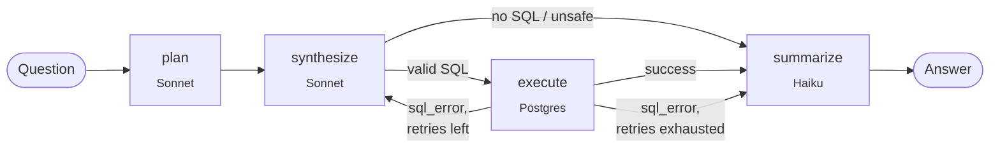

# Energy Text-to-SQL

A natural-language-to-SQL system for the US electricity grid. Ask a
question like *"How did the February 2021 Texas freeze affect ERCOT
demand?"* and get back the SQL, the result table, and a written answer.

Runs locally on Postgres + pgvector + LangGraph + Claude + FastAPI — no
Databricks workspace required. The shape of the pipeline is borrowed from
Databricks' [dbx-unifiedchat](https://github.com/databricks-solutions/dbx-unifiedchat).

> **Status:** v1 + v2 done. Multi-agent pipeline, SSE-streaming UI, and
> vector-routed schema RAG (pgvector + HuggingFace BGE). 12/12 on the
> 12-question eval across all three modes. More v2 ideas in the
> [roadmap](#roadmap).

---

## What it does

Type a question. A four-node LangGraph workflow runs:

1. **plans** the query (which tables, which joins, any pitfalls)
2. **synthesizes** SQL against the schema (Claude Sonnet 4.5)
3. **executes** it on Postgres, with up to 2 retries on SQL errors
4. **summarizes** the rows into a written answer (Claude Haiku 4.5)

The frontend uses SSE so each step appears as soon as it finishes,
instead of blocking on the full 8–15 second round-trip.



### Example questions it can answer

- *"What was the peak hourly ERCOT demand in 2024, and when did it occur?"*
  → 85,544 MWh on Aug 20, 2024 at 23:00 UTC.
- *"Correlation between Houston daily max temperature and average daily ERCOT demand across 2024."*
  → 0.58 — moderate positive correlation, consistent with summer AC load.
- *"During the February 2021 Texas freeze, what was each day's Houston minimum temperature and average daily ERCOT demand?"*
  → Feb 16: Houston at −10.5 °C, demand at ~45,000 MWh. Far below the usual winter peak — the rolling blackouts cut load.

---

## Eval scoreboard

The eval harness (`eval/run.py`) runs each agent against a 12-question
dataset and compares result rows, not SQL strings (sort-insensitive,
float-tolerant).

| Agent | Correct | Total cost | Avg latency | Notes |
|---|---|---|---|---|
| **baseline** (single Claude call, schema in prompt) | 12/12 | $0.054 | 4.6s | First run scored 10/12. The two failures were a UTC-vs-local-date bug in my gold SQL, not the agent's output. |
| **multi** (LangGraph 4-node) | 12/12 | $0.103 | 9.6s | First run scored 7/12. The synthesis prompt was pushing timezone conversion on every query, including ones that didn't need it. |
| **multi + RAG (k=8)** (vector-routed schema via pgvector + HuggingFace) | 12/12 | $0.110 | 9.1s | Retrieves the top-8 most relevant column chunks instead of dumping the whole schema. At 17 chunks the savings don't materialize — see notes below. |

All three modes tie at 12/12. The multi-agent does things the eval can't
score: written summaries, retrying on SQL errors, and handling empty
results without making up an answer.

See [`eval/README.md`](eval/README.md) for the dataset format and known
scorer limitations.

---

## Demo

A short walkthrough — ask the Feb 2021 freeze question, watch the multi-agent stream plan → SQL → result → answer:

https://github.com/user-attachments/assets/5569adfb-883f-4fee-aa64-c644d872ae32

> **Note for visitors:** this runs locally with your own API keys. You'll
> need a free [Anthropic Console](https://console.anthropic.com) key (a few
> dollars covers exploring it) and a free [EIA Open Data](https://www.eia.gov/opendata/register.php)
> key. No keys are bundled — the repo's `.env` is gitignored and never
> contains real credentials.

Run it yourself in about 10 minutes:

### Prerequisites
- macOS or Linux
- Docker (OrbStack recommended on M-series Macs — `brew install --cask orbstack`)
- Python 3.12 + [`uv`](https://docs.astral.sh/uv/) (`brew install uv`)
- An Anthropic API key — register at <https://console.anthropic.com>
- An EIA Open Data key — instant signup at <https://www.eia.gov/opendata/register.php>

### Setup

```bash
git clone https://github.com/visethchapman/energy-text2sql.git
cd energy-text2sql

# config
cp .env.example .env
# edit .env: paste ANTHROPIC_API_KEY and EIA_API_KEY

# database
docker compose up -d

# deps
uv sync

# load data (5 years of ERCOT hourly demand + Houston weather)
uv run python etl/01_load_eia.py --region ERCO
uv run python etl/02_load_noaa.py
uv run python etl/03_schema_docs.py
```

### Run the agent

```bash
# CLI — single question
uv run python agent/baseline.py "What was peak demand in 2024?"

# CLI — interactive REPL
uv run python agent/baseline.py --interactive

# Web UI — multi-agent with streaming
uv run uvicorn server.main:app --port 8000
# then open http://localhost:8000
```

### Run the eval

```bash
uv run python eval/run.py --agent baseline
uv run python eval/run.py --agent multi --save
```

---

## Repository layout

```
.
├── agent/
│   ├── base.py           # Agent protocol shared by both agents
│   ├── baseline.py       # Day 2 single-call agent
│   └── multi.py          # Day 4 LangGraph 4-node agent + streaming
├── eval/
│   ├── dataset.jsonl     # 12 hand-curated questions + gold SQL
│   ├── scorer.py         # result-equivalence comparison
│   ├── run.py            # CLI runner with --agent dispatch
│   └── README.md         # dataset format, semantic gotchas, runs
├── server/
│   └── main.py           # FastAPI: /api/ask, /api/ask/stream (SSE)
├── static/
│   └── index.html        # single-page UI, Pico.css, EventSource
├── db/
│   └── init.sql          # Postgres schemas + pgvector extension
├── etl/                  # data loaders (EIA API + NOAA GHCN-Daily)
├── docker-compose.yml    # Postgres 16 + pgvector
├── TODO.md               # known limitations + v2 work
└── README.md             # you are here
```

---

## What I learned

The parts of this project I'd actually want to talk about if someone
asked.

### The eval caught a bug in my gold SQL

My first eval run scored the baseline at 10/12. Both failures were "wrong
by about 1%" on cross-domain queries. Turned out the agent's SQL was
using `(period AT TIME ZONE 'America/Chicago')::date` to align UTC demand
timestamps with NOAA's local-date observations. My gold SQL was casting
UTC directly. The eval caught the bug in my SQL, not the agent's.

I updated the gold to match the agent's semantics and wrote up what
happened in `eval/README.md`. Takeaway: an eval tests both sides — the
agent's output and your assumptions about what "right" looks like.

### Multi-agent got worse before it got better

The first multi-agent run scored 7/12, worse than the baseline's 12/12.
The synthesis prompt told the model to convert UTC timestamps to local
time, which is the right move for cross-domain joins but wrong for
single-table demand queries. The model applied it everywhere and shifted
year boundaries by 6 hours.

I tightened the prompt so timezone conversion only fires when joining
with NOAA, and the score went back to 12/12. Takeaway: prompt
instructions get followed more literally than you expect, and the eval
is what makes that visible.

### "Multi-agent" doesn't mean what it sounds like

What most people mean by "multi-agent" in 2026 is a graph of LLM nodes
with different prompts that share state. LangGraph, CrewAI, and
dbx-unifiedchat all do this. The academic meaning is autonomous agents
with their own memory and goals, sometimes running in parallel.

This project is the industry kind: a graph of prompts sharing state, not
autonomous agents. I use "multi-agent" because that's the term recruiters
search for, but the graph is one Claude client called with four different
prompts in sequence.

### Schema semantics are harder than SQL

The longest debugging stretches weren't LangGraph syntax or Claude API
quirks. They were figuring out whether "peak demand in 2024" means UTC
2024 or Chicago-local 2024, and how to join a UTC timestamp table with a
local-date table without misaligning days. A text-to-SQL agent has to
understand the semantics, not just the column names, and prompts only
get you partway there.

### Streaming changes how slow agents feel

Without streaming, an 8–15 second wait looks like the page is frozen.
SSE pushes each node's output as it finishes, so plan, SQL, result
table, and answer fill in over the same time window. Total latency is
identical. The experience of using it is not.

### RAG isn't a free lunch at small scale

V2 added vector-routed schema retrieval (pgvector + HuggingFace
`bge-large-en-v1.5` embeddings + HNSW (Hierarchical Navigable Small Worlds) index, k=8). Same pattern Databricks
Genie, Snowflake Cortex Analyst, and Vanna AI use.

At my dataset's tiny scale (17 column chunks) it doesn't save tokens —
it actually *adds* about 9% because formatted column descriptions are
more verbose than a raw schema dump. Accuracy stayed at 12/12.

The pattern is designed for warehouse-scale schemas (1000s of columns)
where the full schema literally can't fit in any prompt. I built it to
demonstrate the production approach, not because 17 chunks needs RAG.
Sometimes the honest answer is *"the technique works, just not on this
size of dataset."*

One detail worth knowing — the **HNSW index is pre-computed at index
creation time**, not at query time. Postgres builds the layered
nearest-neighbor graph once when `CREATE INDEX ... USING hnsw` runs and
incrementally maintains it on every insert. At query time you're just
traversing a structure that already exists, which is why the lookup is
milliseconds even at millions of rows.

---

## Roadmap

### Done
- Day 1: data loaders (EIA + NOAA) + Postgres + pgvector
- Day 2: baseline single-call agent
- Day 3: eval harness + result-equivalence scorer
- Day 4: LangGraph multi-agent (plan / synthesize / execute / summarize)
- Day 5: FastAPI + Pico.css UI + SSE streaming
- Day 6: README + demo video + polish
- Day 7: Vector-routed schema retrieval (pgvector + HuggingFace BGE embeddings, k=8) — v2

### v2 ideas (see [TODO.md](TODO.md))
- Encode region→timezone in the schema (today: hardcoded to Houston/Chicago)
- LLM-as-judge scoring mode to catch summary hallucinations
- Grow eval dataset to ~25 questions, including window functions + cross-region joins
- Load CISO/PJM/NYIS demand for genuine multi-region queries
- DSPy optimizer pass on the synthesis prompt (needs the larger eval set first)
- ~~Vector-search routing over schema cards~~ ✅ shipped Day 7 as multi+RAG mode

---

## License

MIT — see [`LICENSE`](LICENSE).

## Acknowledgments

- Databricks [`dbx-unifiedchat`](https://github.com/databricks-solutions/dbx-unifiedchat) — the
  reference architecture this project borrows from. The plan → synthesize
  → execute → summarize pipeline is from there; the open-stack adaptation
  is mine.
- [EIA Open Data](https://www.eia.gov/opendata/) — hourly electricity
  demand by US balancing authority.
- [NOAA GHCN-Daily](https://www.ncei.noaa.gov/products/land-based-station/global-historical-climatology-network-daily) —
  daily weather observations from thousands of stations.
- Built with [LangGraph](https://github.com/langchain-ai/langgraph),
  [FastAPI](https://fastapi.tiangolo.com/),
  [pgvector](https://github.com/pgvector/pgvector),
  [Pico.css](https://picocss.com/),
  [Anthropic Claude](https://www.anthropic.com), and
  [`uv`](https://docs.astral.sh/uv/).
